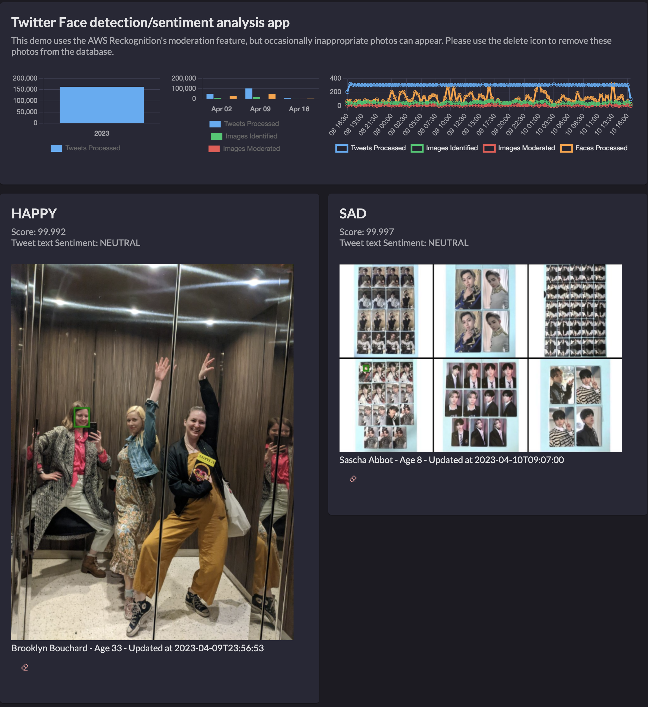
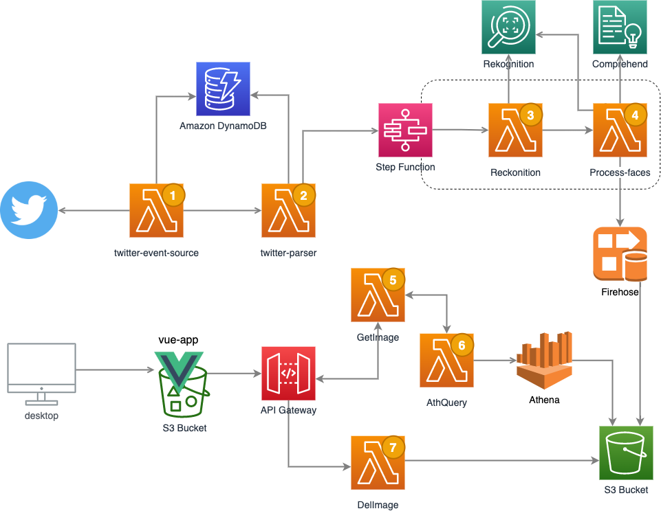

## AWS Serverless face recognition sentiment analysis on twitter 



In this Serverless app we show a rank of the happiest, saddest among other emotions [Amazon Rekognition](https://aws.amazon.com/rekognition/) can detect from tweets that have the word "selfie" in it. The app relies on lambda functions that extract, process, store and report the information from the picture. It is important to note that Twitter is a public platform that does not moderate photos uploaded by its users. This demo uses the AWS Reckognition moderation feature, but occasionally inappropriate photos can appear. **Use at your own discretion**

The Amazon S3 bucket of this solution creates contains two [Object lifecycle management](https://docs.aws.amazon.com/AmazonS3/latest/dev/object-lifecycle-mgmt.html) for the folders where the reports and records files are stored, which expire the files 2 days after of its creation. Similarly, the dynamoDb table that records all the images processed, expires the records after 2 days of its creation.  

Below is the diagram for a depiction of the complete architecture.



The solution also leverage the [Embedded Metric Format](https://docs.aws.amazon.com/AmazonCloudWatch/latest/monitoring/CloudWatch_Embedded_Metric_Format_Specification.html) to create metrics for number of tweets that are being processed, number of images moderated and number of faces identified and processed. There isn't a direct correlations of numbers of tweets and faces processed as not all tweets' images have people, some images are moderated. In some cases one photo can contain more than 10 faces, which makes it impredictable. Becasuse EMF stores the information into AWS CloudWatch metrics, we were able to query it and display the estatitics and the graph data from there. 

Another cool service used is [AWS X-Ray](https://aws.amazon.com/xray/) that allows you to understand how your application and its underlying services are performing to identify and troubleshoot the root cause of performance issues and errors.

## Initial environment setup

### Prerequisites

This app is deployed through AWS CloudFormation with an additional Vue.js application configuration. The following resources are required to be installed:

- [aws SAM](https://aws.amazon.com/serverless/sam/) - A tool to abstract and simplify CloudFormation stack deployments
- npm to be able to build the Vue.js app
- [aws cli](https://docs.aws.amazon.com/cli/latest/userguide/cli-chap-install.html) to be able to interact with the AWS resources
- AWS Account and permissition to create the resources.

### Step 1: Configure the Twitter API keys and the Twitter Event Source Lambda

1. The Twitter polling is based on the https://github.com/awslabs/aws-serverless-twitter-event-source. This lambda is responsible for connecting to twitter and pull the data to be processed. 
   
These are  Twitter Source app initial setup. You can change those in the CloudFormation template: 
- **SearchText** - *selfie* 
- **StreamModeEnabled** - *true*
- **PollingFrequencyInMinutes** - 10 min
- **BatchSize** - 15
- **TweetProcessorFunctionName** - The Parser's Lambda Function Arn.

2. The *Twitter event source* Lambda requires the following Twitter API Keys: Consumer Key (API Key, Consumer Secret (API Secret), Access Token, and Access Token Secret. The following steps walk you through registering the app with your Twitter account to create these values.
   - Create a Twitter account if you do not already have one
   - Register a new application with your Twitter account:
     - Go to http://twitter.com/oauth_clients/new
     - Click "Create New App"
     - Under Name, enter something descriptive (but unique), e.g., aws-serverless-twitter-es
     - Enter a description
     - Under Website, you can enter https://github.com/awslabs/aws-serverless-twitter-event-source
     - Leave Callback URL blank
     - Read and agree to the Twitter Developer Agreement
     - Click "Create your Twitter application"
   - (Optional, but recommended) Restrict the application permissions to read only
     - From the detail page of your Twitter application, click the "Permissions" tab
     - Under the "Access" section, make sure "Read only" is selected and click the "Update Settings" button
   - Generate an access token:
     - From the detail page of your Twitter application, click the "Keys and Access Tokens" tab
     - On this tab, you will already see the Consumer Key (API Key) and Consumer Secret (API Secret) values required by the app.
     - Scroll down to the Access Token section and click "Create my access token"
     - You will now have the Access Token and Access Token Secret values required by the app.


3. The app expects to find the Twitter API keys as encrypted SecureString values in SSM Parameter Store. You can setup the required parameters via the AWS Console or using the following AWS CLI commands:
 ```bash
aws ssm put-parameter --name /twitter-event-source/consumer_key --value <your consumer key value> --type SecureString --overwrite
aws ssm put-parameter --name /twitter-event-source/consumer_secret --value <your consumer secret value> --type SecureString --overwrite
aws ssm put-parameter --name /twitter-event-source/access_token --value <your access token value> --type SecureString --overwrite
aws ssm put-parameter --name /twitter-event-source/access_token_secret --value <your access token secret value> --type SecureString --overwrite
  ```

### Step 2: Execute cnf-cli to deploy all resources required for the solution to work

1. clone this repo and go to its directory
2. Execute aws to package and deploy all resources based on the *tempate.yaml* file. The comand will create a bucket if SAM does not find an existent one.
```bash
sam package --s3-bucket <bucket> --output-template-file out.yaml
sam deploy --template-file out.yaml --capabilities CAPABILITY_IAM CAPABILITY_AUTO_EXPAND --stack-name <stack name>
```
1. Wait until you get the message:
```bash
Successfully created/updated stack - <stack name>.
```

### Step 3 : Create Amazon Athena Database, tables and Kinesis Firehose

1. The script below creates two Athena's tables: *json_records* and *parquet_records* at the *twitter_data* Athena database. These tables determine the schema used at the queries. It also outlines the data transformation from Json to Parquet during the Kinesis Firehose data ingestion.
```bash
./createDbSupport.sh <stack name>
```

:warning: **Important Note: Kinesis Firehose has a 300 seconds Buffer condition.** It means that after the data is processed by lambda, it takes 5 more minutes for you to see the Parquet data at the S3 bucket.

### Step 4: Deploy Vue.js app into S3

1. The script below executes all the steps to publish the Vue.js application into your bucket:
```bash
./appDeploy.sh <stack name>
```

This step updates the code with the AWS resources that were created, compile and deploy the vue.js app into the bucket.

:warning: **Important Note: Some Ad blocking apps can prevent the images to be shown.** 